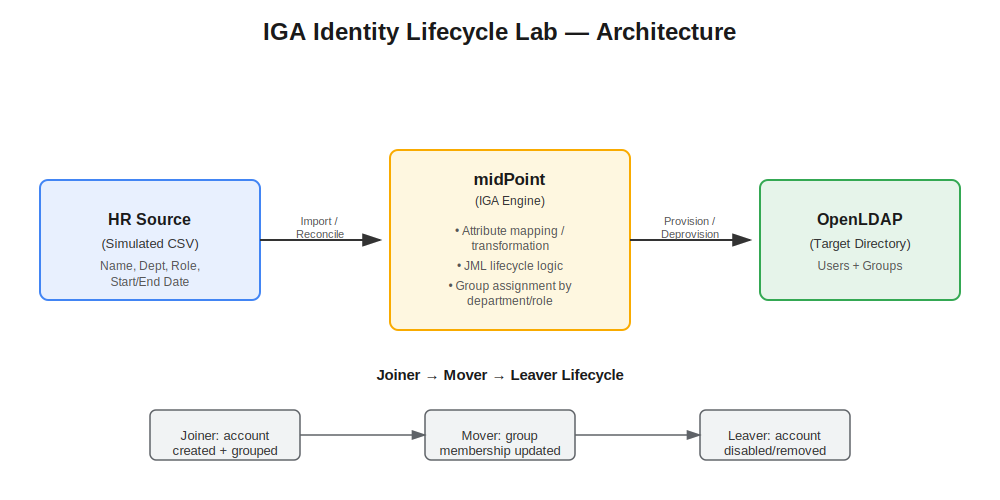
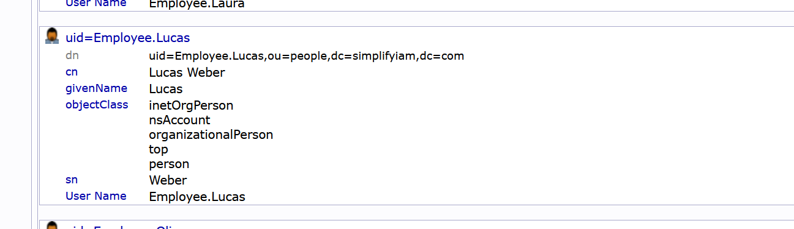

# Identity Governance & Lifecycle Automation (IGA Lab)

## Business Problem

Manual account provisioning is a reasonable way to manage identity in a small organisation — with ten or twenty employees, it's realistic to track who joins, moves role, or leaves by hand, since the volume of change is low enough to manage manually. That changes at scale. Once an organisation grows to hundreds or thousands of employees, manual onboarding and offboarding processes create real security and compliance risk. When employees join, move roles, or leave, manual account creation/updates/removal becomes slow and error-prone — commonly resulting in orphaned accounts (active credentials left behind after someone leaves), which are a frequent finding in security audits and a real attack vector.

## Solution Overview

Built an automated Joiner-Mover-Leaver (JML) identity lifecycle workflow using midPoint as the identity governance engine, integrating a simulated HR data source (CSV) with an OpenLDAP directory as the target system. The specific tools used here — midPoint and OpenLDAP — are illustrative rather than prescriptive; the same lifecycle pattern applies regardless of which IGA engine or directory service sits underneath it (e.g. SailPoint, Active Directory, Entra ID). What this project demonstrates is the underlying identity governance logic — a defined source of truth, automated reconciliation, and lifecycle-driven provisioning — rather than proficiency in any single vendor's product.

## Scope Note

This project focuses on the core mechanics of identity governance and lifecycle automation — specifically, automated Joiner-Mover-Leaver (JML) provisioning and deprovisioning.

Deliberately out of scope for this project: access reviews, entitlement certification, and broader identity governance features. These are covered separately in a later project using Entra ID Governance, once integrated into the full hybrid enterprise environment. This scoping decision keeps each project focused and demonstrable in depth, rather than attempting to cover every IAM capability shallowly across a single lab.

## Architecture

## What I Built

I configured midPoint as the identity governance engine sitting between a simulated HR source system (CSV-based) and an OpenLDAP directory as the target.

**Connectivity setup:** Configured and tested both resource connections in midPoint — the HR CSV source and the OpenLDAP target — confirming successful communication with each before building any workflow logic on top ("Test Connection succeeded" on both).

**Joiner workflow:** Built out the first stage of the Joiner-Mover-Leaver lifecycle — the Joiner process — which follows this flow:

A new employee record is added directly in the HR source (CSV) — the system of record for identity data (name, department, role, etc.). An HR reconciliation task in midPoint pulls that new record in, creating the corresponding identity inside midPoint. Verified the new identity appeared correctly in midPoint after running the HR reconciliation task.

A second reconciliation task, run against the OpenLDAP resource, pushes that identity out to the LDAP directory, creating the actual account. Verified the account appeared correctly in LDAP using an LDAP browser.

**Note on automatic provisioning:** Although the lab instructions describe reconciling HR and then separately reconciling OpenLDAP as two distinct manual steps, in practice a single HR reconciliation task was sufficient to both create the identity in midPoint and automatically provision the corresponding account into OpenLDAP — confirmed by checking the account directly in phpLDAPadmin. 

This reflects how midPoint's resource linking actually works: once a source system is reconciled, provisioning to any linked target resources happens automatically as part of that same lifecycle event, rather than requiring a manual reconciliation per target. This is arguably the more realistic model of automation — a single trigger event (a new HR record) cascades through the system without requiring manual intervention at each downstream target.

This demonstrates the core mechanic of automated provisioning: identity data flows one-way from the authoritative HR source, through midPoint's governance and transformation layer, out to the target directory — with no manual account creation required at any point in the chain.

**Mover workflow:**

The Mover stage of the JML lifecycle covers an existing employee changing department or role, rather than joining or leaving the organisation. This lab's SimplifyHR portal only supports adding a new employee (Joiner) and terminating one (Leaver) — there's no function to edit an existing employee's department, so this stage isn't backed by screenshots the way Joiner and Leaver are.

The process itself, however, is identical in principle to what's already been demonstrated twice in this lab: change the employee's department in HR, run the reconciliation task in the IGA engine (scheduled automatically in a real enterprise environment, rather than run manually as in this lab), then confirm the change has taken effect — both on the identity inside the IGA engine, and on the corresponding account in the target directory, whether that's OpenLDAP, Active Directory, or any other directory service. 

The mechanism doesn't change based on which specific tools are involved; what matters is that a change at the authoritative source cascades through to the target automatically, without manual account editing at either end.
The business risk this addresses is access creep: without an automated Mover process, an employee who changes role typically keeps their old access indefinitely, accumulating permissions beyond what their current role requires — a common and significant finding in access audits.

**Leaver workflow:** Built out the second stage of the Joiner-Mover-Leaver lifecycle — the Leaver process — which follows this flow:

An employee's status is changed to Terminated directly in the HR source (SimplifyHR) — the same authoritative source used for the Joiner event.

Re-ran the existing HR reconciliation task in midPoint (the same task created for the Joiner event — no new task needed, confirming these tasks are reusable across all lifecycle events, not single-use).

midPoint detected the status change and triggered the Leaver workflow automatically — disabling the identity and updating its projection to OpenLDAP.

Verified in midPoint (Users → All Users) that James Anderson's status now shows Disabled, and confirmed via the Projections tab that the OpenLDAP projection reflected this. Verified directly in phpLDAPadmin that James Anderson's account had moved from `ou=people` to `ou=inactive` — confirming the change had actually propagated to the target directory, not just midPoint's internal record.

**Design principle — disable, don't delete:** The account was not deleted on termination, and this is deliberate rather than a limitation. Standard enterprise practice is to disable an account immediately on termination, then delete it only after a defined retention period (commonly 30–90 days). This balances two competing risks: an active account for a departed employee is a security exposure, but immediate deletion removes the ability to investigate, recover data, or audit activity if a question arises after the person has left. Moving the account to an inactive state (rather than deleting it) achieves the security goal immediately while preserving the option to investigate or reverse the action during the retention window.

This reinforces the same underlying principle demonstrated in the Joiner workflow: HR remains the single source of truth, and every downstream system — midPoint, then LDAP — updates automatically in response to a change at the source, without manual intervention at the target.

**Design consideration — reconciliation frequency:** In this lab, reconciliation was triggered manually to clearly observe each stage of the JML flow as it happened. In a production environment, this would typically run on a scheduled interval rather than manually — the appropriate frequency depends on the organization's size and rate of change. A large enterprise with high hire/leaver volume might reconcile every 15–30 minutes to minimize the window where access is out of date, whereas a smaller organization might run it nightly. This is a tuning decision balanced against system load versus how urgently new access or account disablement needs to take effect.

*(Mover stage to be added — see note below on why this couldn't be fully demonstrated in this lab's HR portal.)*

## Troubleshooting & Problems I Hit

**Issue: SSH access unclear (no username specified)**
The lab guide said to SSH in using the IP and port, but didn't clearly state the login username — it was buried in a sentence rather than listed clearly. Had to reread the instructions carefully to spot that "using root" meant the username was root, not just descriptive text. Lesson: always check for a username explicitly before assuming SSH will prompt for one.

**Issue: PuTTY copy-paste not working via trackpad**
Struggled to copy commands from the browser instructions into the PuTTY terminal — right-click paste didn't work reliably on the laptop trackpad. Resolved by using the keyboard shortcut Shift+Insert to paste directly into PuTTY instead of relying on trackpad right-click/two-finger tap.

**Issue: Login attempts failing / temporary lockout**
Got locked out of SSH login temporarily after a few failed password attempts — standard SSH brute-force protection, not a fault with the VM. Waited a short time before retrying rather than repeatedly attempting, which resolved it once the correct username/password combination was confirmed.

**Issue: midPoint service not showing as "up" after starting the lab**
After running the start script, phpLDAPadmin and SimplifyHR came up immediately, but midPoint did not, and the web console at localhost:8080/midpoint returned a connection error. This wasn't an actual failure — midPoint takes noticeably longer to boot than the other services on first startup, since it initializes its own internal database and connectors. Re-checking the status script and refreshing the browser after waiting a few minutes confirmed midPoint had come up successfully. Lesson: don't assume a service has failed just because it isn't immediately up — check again after allowing more startup time, especially for Java-based platforms like midPoint.

**Issue: Reconciliation task creation UI substantially different from lab guide**
The lab guide's instructions for creating and running an HR reconciliation task (Resources → SimplifyHR → Run Task, with fields for Task name and a Schedule → Run now option) didn't match the current midPoint UI at almost every step. In my version, task creation is done via a separate "Server Tasks" menu → "New Task" → selecting "Reconciliation" as the task type, with configuration split across Basic, Activity, Schedule, Advanced options, and Operational attributes tabs. There was no visible "Run now" option under Schedule, and no dedicated task name field as described — instead, a "Save and Run" button under Operational attributes handled both actions at once.

Resolved by working through each tab systematically to identify the functional equivalent of each step described in the guide, rather than relying on exact button names. Confirmed success by checking that the HR record created earlier correctly appeared in midPoint's Users section after running the task.

A note on automation's blind spot
Automation solves the problem of manual processes not keeping pace with scale, but it introduces a different risk: because the process runs in the background, nobody sees it happening day to day, and it's easy to assume it's working correctly simply because nobody's had to think about it. 

A Mover event that silently adds new group access without removing the old is precisely the kind of thing that can go unnoticed for a long time in an automated system — someone accumulates permissions from two or three past roles they no longer need, and because no human is manually reviewing each change, it's rarely caught until an access review or an audit surfaces it.

This is why automation on its own isn't a complete solution — it needs an oversight layer, typically in the form of periodic access reviews and entitlement certification (available in tools like midPoint, Entra ID Governance, or equivalent, depending on the platform in use). Automation handles the speed and consistency problem; governance oversight handles the "is this still correct" problem. Neither replaces the other. This is also why access reviews were named as a deliberate scope boundary earlier in this project — they represent the next layer this lifecycle would need in a real enterprise deployment.

## Business Outcome

Automated provisioning and deprovisioning eliminates the manual gap that leads to orphaned accounts, and provides a full audit trail of every identity change — directly reducing the compliance risk described above.

